# Background

Single binary phylogenetic trees are insufficient to represent the evolution of
viruses possessing segmented genomes. In an infected host cell, each genomic
segment of such a virus is separately replicated, before reassembly to a full viral
genome. If divergent viral strains co-infect a single host cell, segment exchange during
the replication is possible, thus giving rise to a new viral variant. Since each segment gives rise to a separate phylogenetic tree, jointly modelling the
evolution of the whole genome requires a network. Recently, a method to produce
such reassortment networks  was introduced. Here we present an extension of it, which is able to account for population structure. We do so by adapting marginal approximation for structured coalescent (MASCOT, ) to include reassortment dynamics.

----

# Programs used in this Exercise

### BEAST2 - Bayesian Evolutionary Analysis Sampling Trees 2

BEAST2 ([http://www.beast2.org](http://www.beast2.org)) is a free software package for Bayesian evolutionary analysis of molecular sequences using MCMC and strictly oriented toward inference using rooted, time-measured phylogenetic trees. This tutorial is written for BEAST v{{ page.beastversion }} .

### BEAUti2 - Bayesian Evolutionary Analysis Utility

BEAUti2 is a graphical user interface tool for generating BEAST2 XML configuration files.

Both BEAST2 and BEAUti2 are Java programs, which means that the exact same code runs on all platforms. For us it simply means that the interface will be the same on all platforms. The screenshots used in this tutorial are taken on a Mac OS X computer; however, both programs will have the same layout and functionality on both Windows and Linux. BEAUti2 is provided as a part of the BEAST2 package so you do not need to install it separately.

### StructuredNetworkAnnotator

StructuredNetworkAnnotator is used to summarise the posterior sample of networks to produce a maximum clade credibility network. It can also be used to summarise and visualise the posterior estimates of other network parameters (e.g. node height or node type (sub-population that it belongs to)).

StructuredNetworkAnnotator is provided as a part of the SCoRe package.

----

# Practical: Setting up a structured coalescent with reassortment analysis

The structured coalescent with reassortment is an approach that allows inferring migratory reassortment networks and rates of segmented viruses from the genetic sequences of individual segments.
In this tutorial, we will describe how to set up a structured coalecent with reassortment analysis.

## The Data

We use the seasonal influenza A/H3N2 dataset consisting of 12 HA and NA sequenced, that were sampled equally in New Zealand, Hong Kong and USA (New York) between 2000-2001. 
Sequences were downloaded from [fludb.org](fludb.org) and can be found in the data folder.

## Download SCoRe

Currently, SCoRe cannot be downloaded from the BEAST2.6 add-on repository. Therefore we first need to add the custom source directory in BEAUTi. To do so, start BEAUTi and go to  `File >> Manage Packages`. In the bottom menu of the pakcage manager window select `Package repositories`. Then add a new repository URL for SCoRe: https://raw.githubusercontent.com/jugne/SCORE/master/addon.xml and press `Done`. NOTE: due to SCoRe dependencies, this will also deliver you the newer version of Mascot package. 

<figure>
	
	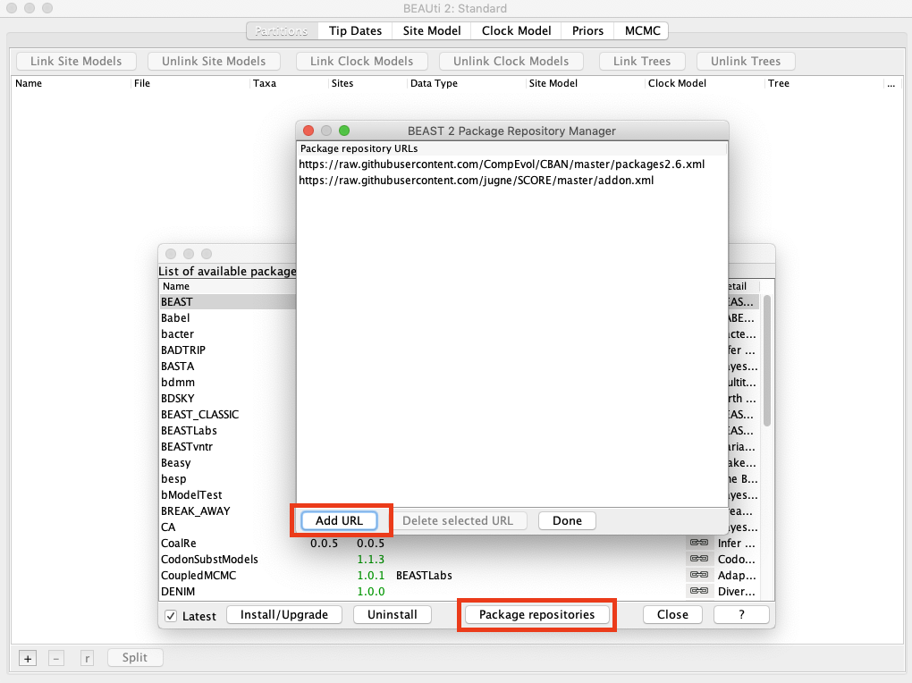
	<figcaption>Figure 1: Add SCoRe repository URL to BEAST2 package manager</figcaption>
</figure>

I the package manager window, you can now find SCoRe among other listed packages. Highlight it and select `Install/Upgrade`. After the package is installed, re-start BEAUti.

<figure>
	
	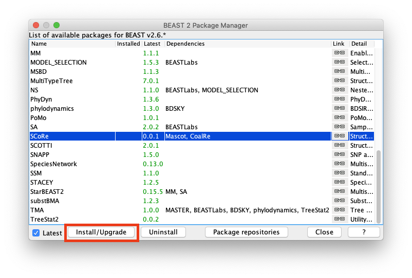
	<figcaption>Figure 2: Install SCoRe package for BEAST2.</figcaption>
</figure>

## Add the sequences

After re-starting BEAUTi, it should open on the partitions tab again. To add sequences select `+` button in the bottom menu and navigate to the data folder. Highlight both .fasta files and select open. You will nom be prompted to specify type of alignments: select that all are nucleotide in the drop-down menu and press `OK`.

Next, we will split alignments into codon positions, which will allow for rate variations between nucleotide sites. Highlight one of the alignments and select `Split` in the bottom menu. 
New pop-up window will open and we choose {1,2}+3 in the drop-down menu, meaning that positions 1 and 2 evolve at the same evolutionary rate.
Repeat this process for the remaining alignment.

<figure>
	
	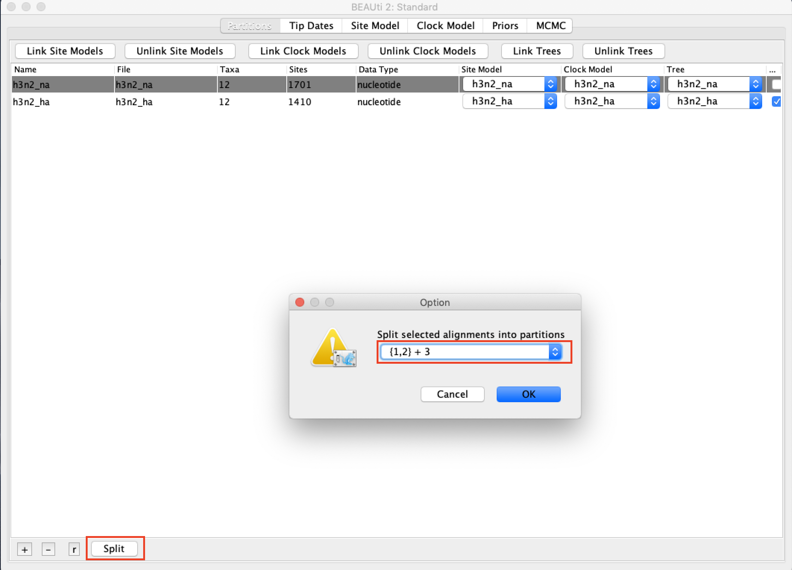
	<figcaption>Figure 3: Splitting of the alignments.</figcaption>
</figure>

## Linking the site models and clock models 

In order to speed up the xml creation, we will temporarily link the site models. This is doen by by highlighting all partitions and selecting `Link Site Models` in the upper menu of the partitions tab.
Additionaly, we will link the clock models. This is done by highlighting all partitions and selecting `Link Clock Models` in the upper menu. It ensures the same evolutionary rates for all partitions.

<figure>
	
	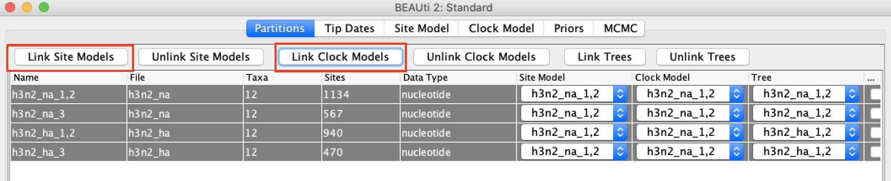
	<figcaption>Figure 3: Linking the site and clock models.</figcaption>
</figure>
 
## Setting up the tip dates

In order to specify sampling times of the network, switch to the `Tip Dates` tab. Here, check `Use tip dates`. Lokking at the `Name` column of listed sequences, you can see that dates are specified in the M/dd/yyyy format.
Therefore select `as dates with format` radio button and choose `M/dd/yyyy` in the drop down menu. Then press `Auto-configure`. In the new pop-up window, select `split on character`, enter the character `|` and `and take group(s): 2`. Press `OK` to close the pop-up window.

<figure>
	
	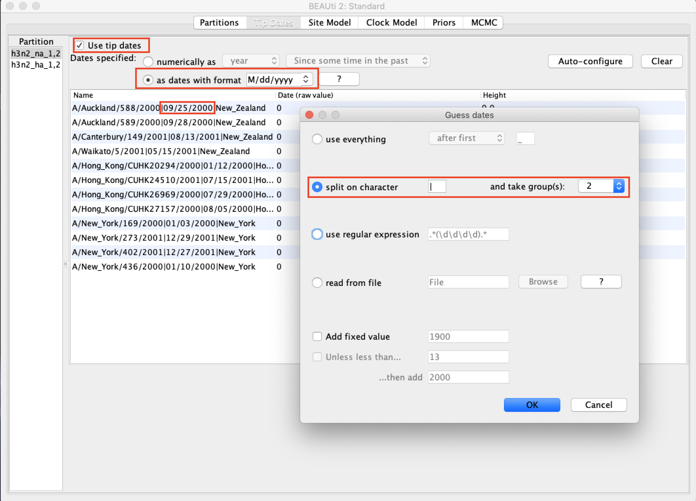
	<figcaption>Figure 5: Specify tip dates .</figcaption>
</figure>

To clone tip fdates for the second partition, highlight both in the left hand menu and select `OK`.

## Setting up the site model

Now it is time to choose the appropriate site model for the data. In this example, we choose the $HKY+\Gamma_4$ model. First, check `estimate` for the `Substitution Rate` and enter 4 at `Gamma Category Count`. Then, select `HKY` in the `Subst Model` drop-down menu.

<figure>
	
	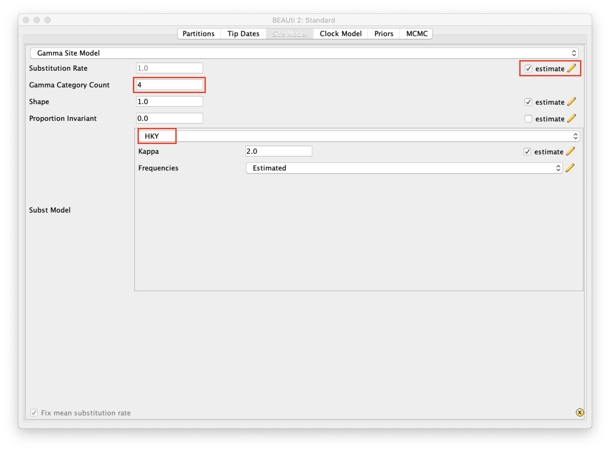
	<figcaption>Figure 6: Specify the site model.</figcaption>
</figure>

Now, that we set up the site model, we switch back to the `Partitions` tab, highlight all partitions and select `Unlink Site Models`. This allows them to follow the same model, but be estimated independently.

## Setting up the priors

We will use strict clock model here, which is the default. Next, switch to the `Priors` tab. For both  segment trees select `SCORE` in the drop down menu. 
Then, expand `SCoRePrior.alltrees` section by clicking on the black arrow. You many the initial valuesof parameters as is, since they are by default estimated.
However, you need to specify the `Location` (types) for your structured dataset. To do this, select `Guess` button, above the list of sequences. Then, choose `use everything`, `after last`, `|`.
Click `OK` and verify that three locations have been "guessed": New Zealand, Hong Kong and New York.

<figure>
	
	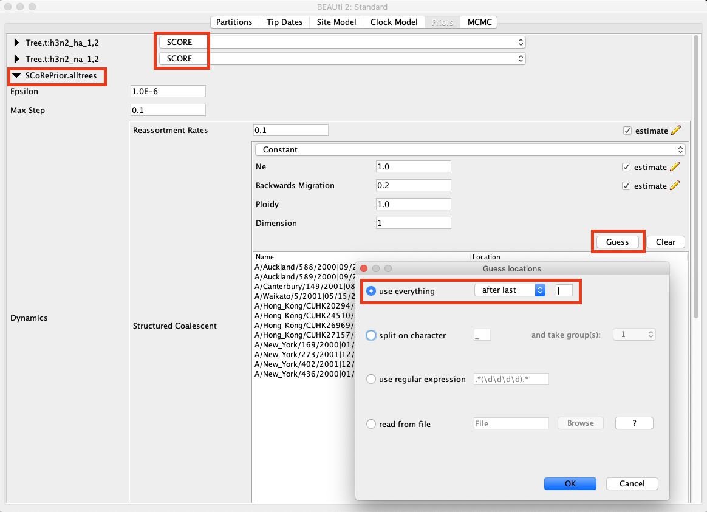
	<figcaption>Figure 8: Setting up SCORE prior.</figcaption>
</figure>

Now, scroll to the bottom of the window in order to specify the prior distribution of the parameters. We choose exponential priors for migration and reassortment rates. We will put more restrictive prior on reassortment rate with mean of 0.25, but allow higher values for backwards migration rate with mean of the prior distrubution at 1.0. Remember that therse rates are per lineage and per year. For effective population size, we choose the LogNormal distribution. 
 
<figure>
	
	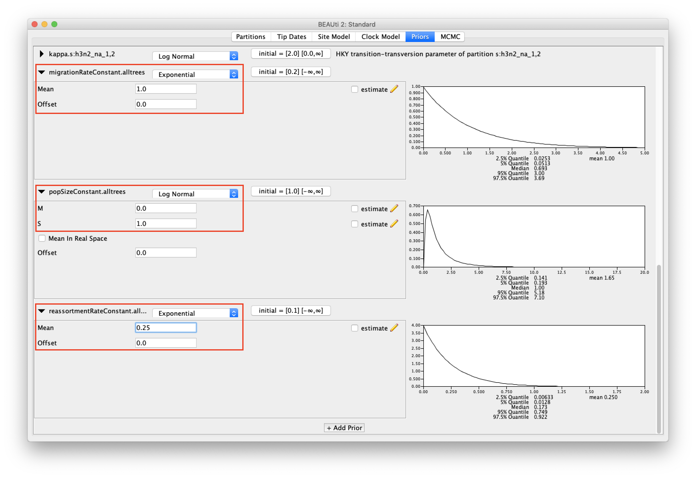
	<figcaption>Figure 9: Setting the prior distribution on the model rates.</figcaption>
</figure>

## Setting up the Chain Length

Now, switch to the `MCMC` tab. Here we will set for how many iterations our MCMC chain will run and how often it will be logged. Set `Chain Length` to 5 million and `Store Every` to 1000. Storing your chain is helpful in case the run was interrupted - it allows you to resume from the last stored network, not repeat the whole run. Then, we recommend to set `Pre Burnin` value to 1000. During the burnin, BEAST2 does not log the network which means that stochastic mapping algorithm is also not triggered. Due to a rejection step, the algorithm can be very slow for high values of reassortment rate. These values are much more likely in the initial states when more extreme values in the prior are proposed and accepted, since information in the data usually suggests lower reassortment rates. 

Next, expand `tracelog` and put down a name for the log file, e.g., h3n2.log. Lastly, expand `networkCwRLogger.alltrees` and put 1000 at `Log Every`. In general, it is a good idea to always set storring and all logging frequancies to the smae number. If the number of last logged state is different, BEAST cannot resume the run from the state.

<figure>
	
	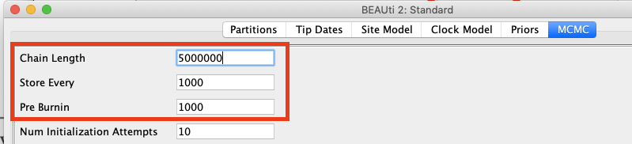
	<figcaption>Figure 10: Set the chain length.</figcaption>
</figure>

<figure>
	
	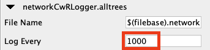
	<figcaption>Figure 10: Set the network storring interval.</figcaption>
</figure>

## Save and run the xml	

The final step in BEAUTi is saving your configuration in an xml file. To do so, in the upper menu select `File`, then `Save` and choose your preferred location.
Now you are ready to run the analysis in `BEAST`. Open `BEAST` and run the xml from the previous step. 
Next, open `BEAST` and run the xml. You can also skip the run yourself and find the output files in the `output` folder.

## Inspect the run in Tracer

Next we can check the output log file in `Tracer`. Open Tracer on your computer and drag-and-drop h3n2.log file in it. 
First, check if the run converged, that is, if ESS for all values is above 100 (100 is a good number for our toy example here, however for application to real data analyses, ESS above 200 should be ensured) and trace of posterior looks similar to the picture below.

<figure>
	
	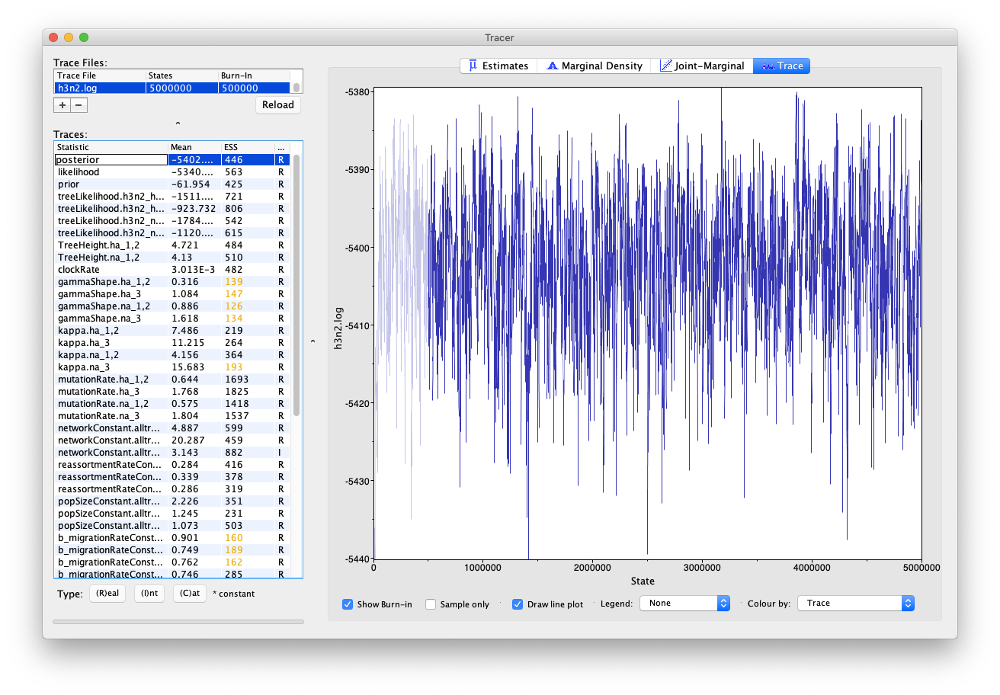
	<figcaption>Figure 11: Convergence in Tracer.</figcaption>
</figure>

Then, look for rates specific to the SCoRe model: reassortment, migration and coalescent rates. Importantly, especially in case of migration, that the rates are backwards in time and - since our model is structured - type specific.
Another interesting parameter is the `Root state` of a network. It tells us the probability for the network origin to be in different types.

<figure>
	
	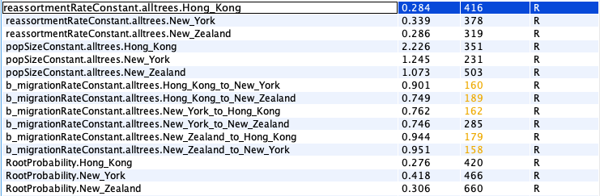
	<figcaption>Figure 12: Parameter values obtained by SCoRe.</figcaption>
</figure>

## Summarize the posterior distribution of structured networks

We can also summarize the posterior distribution networks into a maximum clade credibility network. In the upper menu of `BEAUti` select `File > Launch Apps` and `Strcutured Network Annotator`.
For the `Strcutured Reassortment Network log file`choose `h3n2.networks.trees` output file and click `Analyze`.

<figure>
	
	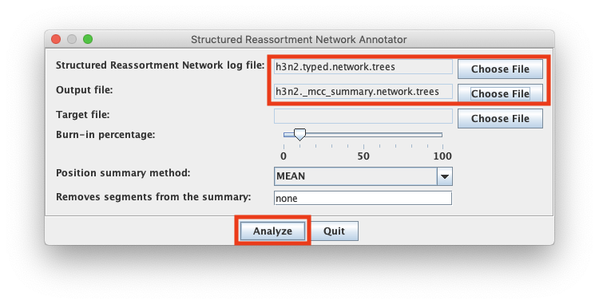
	<figcaption>Figure 12: Produce the maximum clade credibility network.</figcaption>
</figure>

Note, that the intermediate migration events (type switches that happen NOT on a coalescent or reassortment node) will not be included. They are accounted for by noting the type change on network node, while type of the lineage is equal to the type of its child.
This is only true for the maximum clade credibility network. In case of any single posterior sample network, migration events on lineages are also showed.

## Visualize the network using icytree.org

Lastly, we can inspect the inferred mcc network with [icytree.org](icytree.org). To do so, open [icytree.org](icytree.org) in your browser and drag-and-drop the summarized network file.
At reassortment event, the two parent lineages will be ploted either by a solid or dashed line. To observe most probable lineage states, go to `Style -> Color edges by -> state`. If the posterior probabilities for a lineage to be in a several states are equal, it is indicated in a legend by a formula "State1 + State2". We see this in our example for two lineages which are equally likely to be in New Zealand or Hong Kong. This is expected in a toy example and indicated not enough data or runtime to resolve the lineage states.
You may also observe 95 $\%$ highest posterior density intervals for node heights by `Style > Node height error bars`. 

<figure>
	
	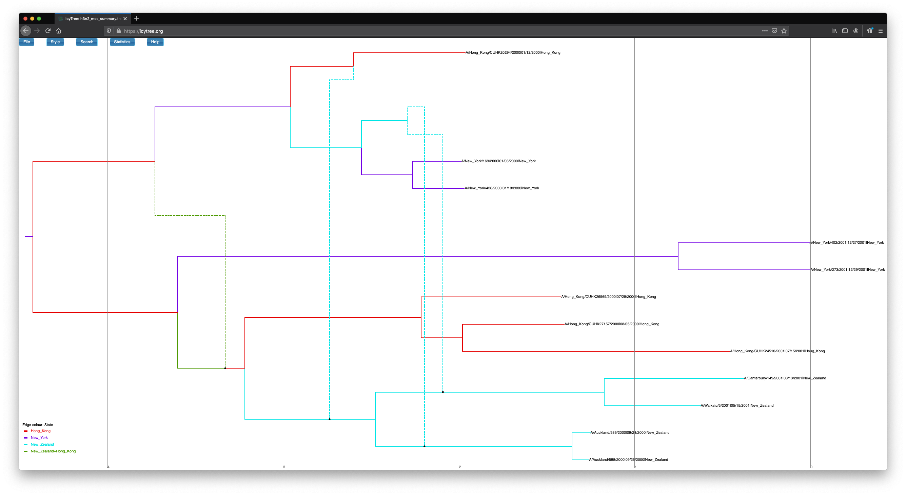
	<figcaption>Figure 13: Visualize the structured mcc network in icytree.</figcaption>
</figure>

----

# Useful Links

- BEAST 2 website and documentation: [http://www.beast2.org/](http://www.beast2.org/)
- Join the BEAST user discussion: [http://groups.google.com/group/beast-users](http://groups.google.com/group/beast-users)

----

# Relevant References


